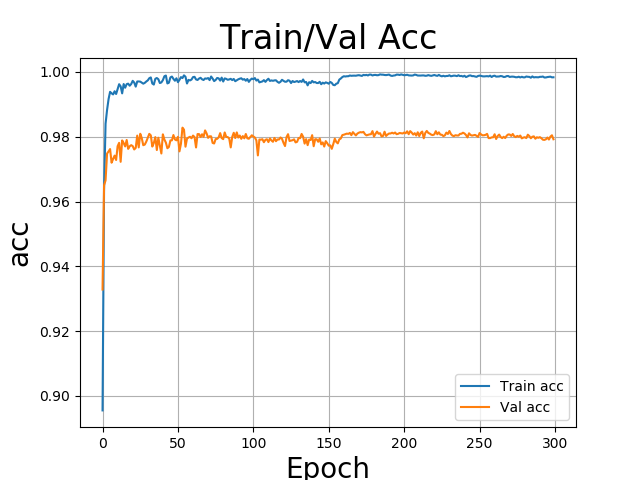
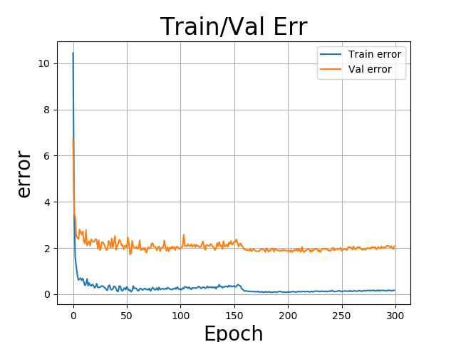

# Bayes by Backprop    
[TOC]

## 一、简介

[Weight Uncertainty in Neural Networks](https://arxiv.org/pdf/1505.05424.pdf)

  传统的神经网络学习的权重w是个固定的值，而本文的贝叶斯神经网络学习的是权重的分布。该网络在推理时用蒙特卡罗法采样，生成多个不同的权重,然后对相同输入推理为不同概率分布，然后再取平均，相当于起到了集成模型的作用，本文认为潜在不确定性的权重能够提升网络的泛化能力。

  本项目综合参考了两个repo，尽可能和论文保持一致（mixture prior，损失函数），由于损失函数中kl用的是-elbo，故名为bayes_elbo_paddle,参考见结尾。

## 二、复现精度

 MNIST测试集上，Test Error=1.5917%（尚未达到指标）

下面是跑了二百轮的指标，具体要达到精度还需要在跑会。






## 三、数据集
MNIST手写数字数据集，共有6w训练集、1w测试集，像素为28。本项目从训练集划出1w做为验证集，用于选择模型，并把所有像素除126作为预处理。
## 四、环境依赖
- 硬件：
  - Aistudio 至尊版本 V100
- 框架
  - PaddlePaddle >=2.0.0

## 五、快速开始

### 5.1训练

```
python main.py --config ./conf/base.yaml --mode train
```

### 5.2 评估

```
python main.py  --config ./conf/base.yaml --mode eval
```

### 5.3 预测

```
python main.py  --config ./conf/base.yaml --mode pred
```

## 六、代码结构与详细说明

### 6.1 目录结构

```
.
├── README_cn.md
├── checkpoints # 模型权重
├── config # 配置文件
├── data # 数据加载
├── eval.py # 评估脚本
├── image # 指标图片
├── logs # 日志
├── main.py # 主函数，负责训练、评估、预测
├── model
│   ├── xxxNet.py  # 贝叶斯神经网络
│   ├── layers
│   │   ├── bayes_conv.py 贝叶斯conv算子
│   │   ├── bayes_conv_lrt.py 贝叶斯conv算子（带有局部重参数化trick）
│   │   ├── bayes_linear.py 贝叶斯linear算子
│   │   ├── bayes_linear_lrt.py 贝叶斯linear算子（带有局部重参数化trick）
│       └── misc.py #贝叶斯模型基类
│   └── samplers # 采样，包括μ、ρ、和mixture prior
│       ├── __init__.py
│       ├── gaussian_variational.py # 根据μ、ρ生成σ
│       └── scale_mixture.py # 根据Π、σ1、σ2计算prior
├── predict.py # 预测脚本
├── train.py # 训练脚本
└── utils # 日志、指标等工具

```

### 6.2 参数说明

```
############### Configuration file for Bayesian ###############
data:
  name: MNIST # 'MNIST','CIFAR10','CIFAR100' # 数据集名
  input_size: [1,28,28] # 数据集大小
  # 归一化
  mean: [0.]
  std: [126.]
  class_dim: 10 #类别数
  valid_size: 10000 #验证集大小，如果是0-1间小数则按比例取，如果是整数则取valid_size个验证集
  num_workers: 0 # 加载数据的线程数

hparas:
  seeds: 2021 # 随机种子
  start_epoch: 0 # 开始训练轮数
  num_epochs: 600 # 总训练轮数
  batch_size: 128 # batch大小
  learning_strategy:
    lr_start: 1e-3 # 初始学习率        
    lr_decay: 0.95 # 学习率衰减比
    weight_decay: 0.15 #权重衰减
  visual_epochs: 50 # 画图间隔
  save_epochs: 50 #保存模型间隔

model:
  name: 2fc # [lenet,alex,3conv3fc,2fc] 模型名
  layer_type: bbb  # 'bbb' or 'lrt' # 层类型，贝叶斯反向传播、或带有局部重参数化trick的bayes层
  load_name: model_best_lrt.pdparams # model_best_bbb,model_best_lrt #加载训练好的模型
  activation_type: relu  # 'softplus' or 'relu' # 激活函数
  beta_type: Blundell # 'Blundell', 'Standard',或常量 （Blundell是论文里对mini-batch的加权法）
  train_ens: 2 # 训练时模型集成数
  valid_ens: 6 # 验证时模型集成数
  priors: # 先验+后验
    # scale mixture prior (sigma is -logσ)
    prior_pi:   0.75 #0.25 or 0.5 or 0.75 #先验的混合比例Π
    prior_sigma1: 2 # 0 or 1 or 2
    prior_sigma2: 8 # 6 or 7 or 8
    # gaussian posterior
    posterior_mu_initial: [-0.2, 0.2]  # (low, high) uniform_  
    posterior_rho_initial: [-5.0, -4.0] # (low, high) uniform_
  save_dir: "checkpoints" # 保存模型目录

model:
  name: BBBMlp
  layer_type: bbb  # 'bbb' or 'lrt'
  load_name: model_best.pdparams # model_best_bbb,model_best_lrt
  train_ens: 2 # 训练集成数
  valid_ens: 31 # 验证集成数
  params:
    # scale mixture prior (sigma is -logσ)
    prior_pi:   0.75 #0.25 or 0.5 or 0.75
    prior_sigma1: 2 # 0 or 1 or 2
    prior_sigma2: 8 # 6 or 7 or 8
    # gaussian posterior
    posterior_mu_initial: [-0.2, 0.2]  # (low, high) uniform_  (yaml识别不了圆括号，会当成字符串)
    posterior_rho_initial: [-5.0, -4.0] # (low, high) uniform_
  save_dir: "checkpoints"

```

## 七、模型信息

### 7.1 相关信息

| 数据集 | 模型                          | Test-error | 权重链接                                                     |
| ------ | ----------------------------- | ---------- | ------------------------------------------------------------ |
| MNIST  | bayesfc-bbb(1200units/layer)  | 1.5917% | [链接](https://pan.baidu.com/s/11NK9eCX2pDb8NtC7C7d0OQ)提取码：0aoa |

[aistudio地址](https://aistudio.baidu.com/aistudio/projectdetail/2291689?shared=1)

### 7.2 参考

https://github.com/kumar-shridhar/PyTorch-BayesianCNN

https://github.com/danielkelshaw/WeightUncertainty

